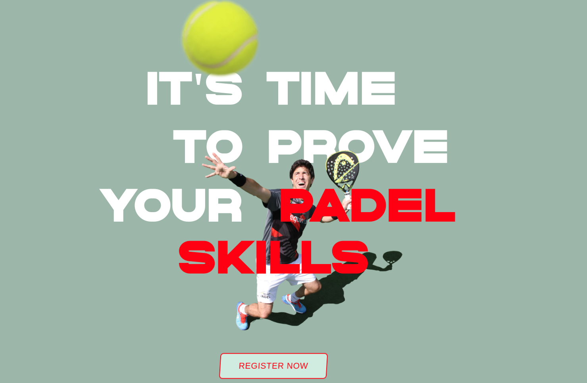

## vue-padel-tour
# This is a concept Vue project

I started this project to practice some `Vue.js`, since most of the things I've been doing were made with React. 
In addition, some friends want to organize a Padel tournament, so maybe this could help us reach to as many people as possible with a great presentaion.

## How to run it?
Go into the main directory of this project:
```
cd vue-padel-tour/
```

After that, serve the site with npm

```
npm run serve
```

Check [http://localhost:8080/](http://localhost:8080/)


### Preview



